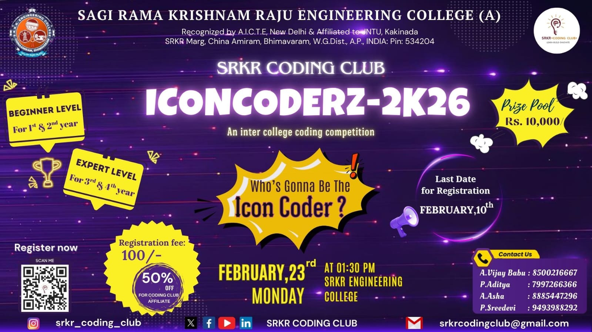
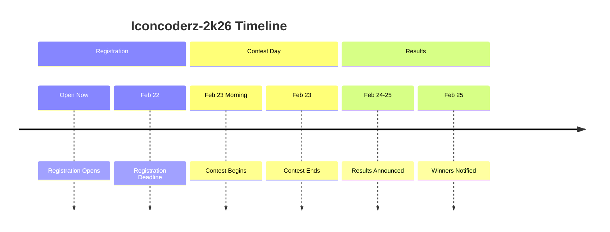

# Iconcoderz-2k26

## Event Details

**Event Name:** Iconcoderz-2k26  
**Tagline:** Decode • Compete • Dominate  
**Event Date:** 23rd February 2026 (Monday) | 1:30 PM IST  
**Mode:** Online  
**Participation:** Individual Only  
**Eligibility:** 1st, 2nd & 3rd Year Students of SRKR Engineering College  
**Registration Fee:** ₹200/-  
**Venue:** SRKR Engineering College, Bhimavaram  
**Registration Link:** [srkrcodingclub.in](https://srkrcodingclub.in)  
**Contact:** srkrcodingclub@gmail.com

---

<strong style="font-size: x-large;">Description</strong>

Welcome to **Iconcoderz-2k26**, a premier competitive programming contest organized by SRKR Coding Club! This event is designed to challenge your Data Structures and Algorithms skills and push your problem-solving abilities to the limit.

Iconcoderz-2k26 is a single-round, online competitive programming contest exclusively for SRKR Engineering College students. Whether you're a coding veteran or just starting your competitive programming journey, this is your chance to test your skills, compete with your peers, and stand out on campus.

The contest features algorithmic problems of varying difficulty levels, from easy warm-up problems to challenging brain-teasers. Participants will compete individually to solve as many problems as possible within the given time frame.

Top performers will be recognized with exciting cash prizes and certificates, providing a valuable addition to their academic and professional portfolios.

<strong style="font-size: x-large;">Guidelines</strong>

**Platform:** The contest will be hosted on a competitive programming platform (to be announced).

**Languages Supported:** C, C++, Python, Java, JavaScript, and more.

**Internet Access:** Participants must have a stable internet connection for the duration of the contest.

**Equipment:** Participants should use their own computers/laptops.

**Certificates:** All participants will receive participation certificates via email after the event.

**Results:** Results will be announced within 24-48 hours after the contest ends.

<strong style="font-size: x-large;">Rules and Regulations</strong>

**Eligibility:** Only 1st, 2nd, and 3rd year students of SRKR Engineering College are eligible to participate. Final year students are not allowed.

**Participation:** This is an individual competition. Team entries are not allowed.

**Registration:** All registrations must be completed with valid college registration numbers.

**Registration Fee:** ₹200 per participant, payable via UPI. Payment screenshot must be uploaded during registration.

**Code of Conduct:** 
- Plagiarism is strictly prohibited
- Discussing problems with others during the contest is not allowed
- Using AI tools during the contest is prohibited
- Any violation may result in immediate disqualification

**Multiple Registrations:** Each participant can register only once.

**Evaluation:** Solutions will be evaluated based on correctness and execution time. Partial scoring may apply for some problems.

**Decisions:** The organizing committee's decisions are final and binding.

<strong style="font-size: x-large;">Judging Criteria</strong>

Participants will be ranked based on:

- **Problems Solved:** Number of problems correctly solved
- **Time Taken:** Total time taken to solve problems (including penalty time)
- **Penalty:** Wrong submissions add penalty time to the total

**Tie-breaker:** In case of a tie, the participant with the earlier last successful submission wins.

The jury's decisions are final and binding.

<strong style="font-size: x-large;">Topics Covered</strong>

Iconcoderz-2k26 will feature problems from the following DSA topics:

- Arrays & Strings
- Linked Lists & Stacks
- Trees & Graphs
- Sorting & Searching
- Dynamic Programming
- Greedy Algorithms
- Recursion & Backtracking
- Number Theory & Math

---

## Event Schedule

---

## Prizes & Perks

🏆 **Cash Prizes** for top performers  
📜 **Certificates** for all participants  
🌟 **Recognition** on official channels  

*Detailed prize pool coming soon!*

---

## FAQs

Who can participate in Iconcoderz-2k26?

Only 1st, 2nd, and 3rd year students of SRKR Engineering College are eligible.

Is team participation allowed?

No, Iconcoderz-2k26 is an individual competition only.

What is the registration fee?

The registration fee is ₹200 per participant.

What programming languages are supported?

C, C++, Python, Java, JavaScript, and more languages will be supported.

Can I use online resources during the contest?

You may use standard documentation. However, discussing with others or using AI tools is prohibited.

How do I prepare for the contest?

Practice on platforms like LeetCode, CodeChef, and Codeforces. Focus on DSA fundamentals.

When will results be announced?

Results will be announced within 24-48 hours after the contest ends.

How do I register?

Visit the registration page on our website and complete the multi-step form with your details and payment.

---

## About the Organizers

**SRKR Coding Club** is a student-led organization at SRKR Engineering College dedicated to fostering a coding culture, organizing technical events, and promoting innovation and collaboration among students. We aim to bridge the gap between academia and industry through workshops, hackathons, coding contests, and networking opportunities.

---

## Contact Details

For inquiries, please contact:

- 📧 **Email:** srkrcodingclub@gmail.com
- 🌐 **Website:** [srkrcodingclub.in](https://srkrcodingclub.in)
- 📱 **Instagram:** [@srkrcodingclub](https://instagram.com/srkrcodingclub)
- 💻 **GitHub:** [srkrcodingclub](https://github.com/srkrcodingclub)

